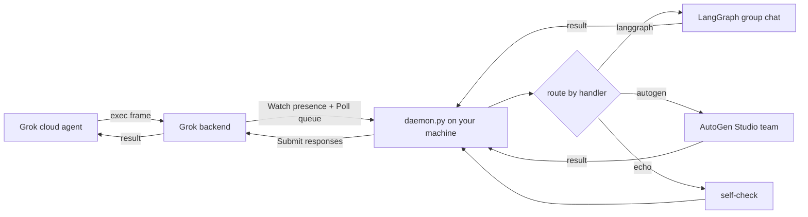

# grok-bridge

A local multi-agent bridge for **Grok Bot** (desktop, v0.30+). It registers your machine
on the app's official `UserComputer` channel, so that cloud agents can dispatch work to
your device — where this daemon hands the task to a **local multi-agent pipeline**
(LangGraph group chat or an AutoGen Studio team) and streams the result back.

> **Unofficial research project.** Not affiliated with Anysphere/Cursor or xAI. It calls
> undocumented endpoints with *your own* logged-in account; usage may violate the app's
> terms of service and carries account-risk. Use at your own discretion.

## How it works



The `exec` frame's payload is a small JSON contract:

```json
{"handler": "langgraph" | "autogen" | "echo", "task": "what to do"}
```

Docs: [protocol notes](docs/protocol.md) · [writing a handler](docs/handlers.md)

## Setup (Windows)

1. Install and log in to the Grok Bot desktop app (v0.30+).
2. Create `state/config.json` from `state/config.example.json`:
   - `gateway` — an OpenAI-compatible endpoint used by your local agents
     (served through `local_proxy.py` on `127.0.0.1:18082`);
   - `local_root`, `label`, `ags_user` — your workspace path, device label, AGS user.
3. Store your gateway API key encrypted (DPAPI, current-user only):

   ```python
   import bridge_common as bc
   bc.set_codex_key("sk-...")
   ```

4. Create a venv and start both processes (scheduled tasks recommended):

   ```
   python -m venv .venv
   .venv\Scripts\python.exe -m pip install -r requirements.txt
   start_proxy.cmd   &   start_daemon.cmd
   ```

5. Send a test task:

   ```
   .venv\Scripts\python.exe tools\inject_exec.py echo "self check"
   ```

## Handlers

| handler | backend | shape |
| --- | --- | --- |
| `langgraph` | LangGraph dev server (`:2024`), selector-based group chat | planner → researcher → analyst |
| `autogen` | AutoGen Studio (`:8081`), round-robin team | planner → researcher → analyst (TERMINATE) |
| `echo` | — | self-check |

Adding an engine is one function in `HANDLERS`.

## Security model

- The Grok Bot access token is **derived at runtime** from the app's encrypted store
  (Chromium `os_crypt` v10 → DPAPI → AES-GCM). No plaintext token on disk.
- The gateway API key is stored **DPAPI-encrypted** (`state/codex_key.bin`).
- `state/` (device identity, config, key blob) and `logs/` are gitignored.
- The daemon executes handler functions, not raw shell commands.

## Known limitations

- The `messagesOp` frame type is reserved by the vendor and stripped server-side;
  the bridge handles `exec` frames.
- If a task runs longer than the caller's wait window, the caller sees
  "user computer unavailable" while the result is still delivered asynchronously.
- Windows-only (DPAPI).

## License

[MIT](LICENSE)

