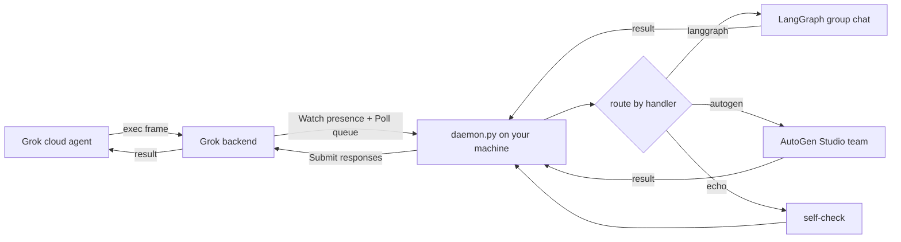

# grok-bridge

A local multi-agent bridge for **Grok Bot** (desktop, v0.30+). It registers your machine
on the app's official `UserComputer` channel, so that cloud agents can dispatch work to
your device — where this daemon hands the task to a **local multi-agent pipeline**
(LangGraph group chat or an AutoGen Studio team) and streams the result back.

> **Unofficial research project.** Not affiliated with Anysphere/Cursor or xAI. It calls
> undocumented endpoints with *your own* logged-in account; usage may violate the app's
> terms of service and carries account-risk. Use at your own discretion.

## How it works



The `exec` frame's payload is a small JSON contract:

```json
{"handler": "langgraph" | "autogen" | "echo", "task": "what to do"}
```

Docs: [protocol notes](docs/protocol.md) · [writing a handler](docs/handlers.md)

## Setup (Windows)

1. Install and log in to the Grok Bot desktop app (v0.30+).
2. Create `state/config.json` from `state/config.example.json`:
   - `gateway` — an OpenAI-compatible endpoint used by your local agents
     (served through `local_proxy.py` on `127.0.0.1:18082`);
   - `local_root`, `label`, `ags_user` — your workspace path, device label, AGS user.
3. Store your gateway API key encrypted (DPAPI, current-user only):

   ```python
   import bridge_common as bc
   bc.set_codex_key("sk-...")
   ```

4. Create a venv and start both processes (scheduled tasks recommended):

   ```
   python -m venv .venv
   .venv\Scripts\python.exe -m pip install -r requirements.txt
   start_proxy.cmd   &   start_daemon.cmd
   ```

5. Send a test task:

   ```
   .venv\Scripts\python.exe tools\inject_exec.py echo "self check"
   ```

## Handlers

| handler | backend | shape |
| --- | --- | --- |
| `langgraph` | LangGraph dev server (`:2024`), selector-based group chat | planner → researcher → analyst |
| `autogen` | AutoGen Studio (`:8081`), round-robin team | planner → researcher → analyst (TERMINATE) |
| `echo` | — | self-check |

Adding an engine is one function in `HANDLERS`.

## Standalone mode (Grok-independent)

The daemon exposes a local HTTP entry point with the same handler contract:

```
GET  http://127.0.0.1:18083/health          → {"ok": true, "engines": [...]}
POST http://127.0.0.1:18083/run             → {"handler": "...", "task": "..."}
```

This path never touches Grok — even if your Grok Bot quota is exhausted or the
account is gone, the multi-agent pipelines keep working. The Grok UserComputer
channel and the standalone API run in parallel and share the same dispatch layer.

Bind/port are configurable via `state/config.json` (`standalone_bind`,
`standalone_port`, default `127.0.0.1:18083` — local-only by design).

## Transport selection

Choose which transports run via `state/config.json`:

```json
{"transports": ["grok", "standalone"]}
```

- `["grok", "standalone"]` — both (default)
- `["grok"]` — cloud-dispatch only
- `["standalone"]` — fully Grok-independent (no Grok API calls at all)

`GET /health` reports the active transports. Invalid or empty values are rejected
at startup.

## Quota exhaustion → local model fallback

A quota watcher polls `GetSandUsageStatus` (every `quota_check_minutes`, default 10).
When `usagePercent` hits `quota_threshold` (default 100), a **Windows dialog pops up**:

> "Grok 周配额已用完（100%）。是否切换到本地模型（Ollama）继续工作？" 是/否

- **是** → `policy = local`: tasks without an explicit handler route to the local
  Ollama model (`ollama_url` + `ollama_model` in config)
- **否** → `policy = wait`: keep waiting for the weekly reset

The choice is changeable anytime: local console at `http://127.0.0.1:18083/ui`
(quota card + policy toggle + direct task submission), or
`POST /policy {"mode": "local" | "auto" | "wait"}`. `GET /quota` returns live usage.

The local-model path uses **your own compute** (Ollama) — Grok quota exhaustion does
not affect it. The cloud agent's own quota only governs what the *Bot* can do.

## Gateway failover

`local_proxy.py` supports multiple upstreams in `state/config.json`:

```json
{"upstreams": [{"name": "primary", "url": "http://host-a/v1"}, {"name": "fallback", "url": "http://host-b/v1"}]}
```

Connect errors, timeouts, 5xx and 429 trigger automatic failover to the next
upstream; the last healthy one is sticky. Per-upstream API keys are stored
DPAPI-encrypted in `state/gateway_keys.bin`.

## Security model

- The Grok Bot access token is **derived at runtime** from the app's encrypted store
  (Chromium `os_crypt` v10 → DPAPI → AES-GCM). No plaintext token on disk.
- The gateway API key is stored **DPAPI-encrypted** (`state/codex_key.bin`).
- `state/` (device identity, config, key blob) and `logs/` are gitignored.
- The daemon executes handler functions, not raw shell commands.

## Known limitations

- The `messagesOp` frame type is reserved by the vendor and stripped server-side;
  the bridge handles `exec` frames.
- If a task runs longer than the caller's wait window, the caller sees
  "user computer unavailable" while the result is still delivered asynchronously.
- Windows-only (DPAPI).

## License

[MIT](LICENSE)

