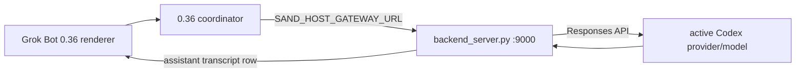

# grok-bridge

This repository contains a local bridge for **Grok Bot**. The current acceptance target
is the Grok Bot **0.36.0** desktop candidate. The desktop coordinator connects to
`backend_server.py` on `127.0.0.1:9000`; the backend mirrors the active Codex model
binding by default, then writes assistant rows back to the local transcript for the
renderer. Hosted GitHub Actions and external Discord/Slack channels are not part of
this acceptance path.

> **Unofficial research project.** Not affiliated with Anysphere/Cursor or xAI. It calls
> undocumented endpoints with *your own* logged-in account; usage may violate the app's
> terms of service and carries account-risk. Use at your own discretion.

## Current Grok Bot 0.36 local path



The 0.36 candidate is patched to keep these bundled defaults local:

- `sand_send_via_server=false`
- `sand_roster_via_server=false`
- `sand_transcript_server_tail=false`
- `sand_channels=true`

The coordinator is only materialized when `SAND_HOST_GATEWAY_URL` is present in the
Grok Bot process environment. Use `tools/start_grok_bot_036_local.ps1`; launching the
EXE directly does not establish that contract. The launcher rejects non-loopback
gateways and its normal mode may start the local backend before restarting the app.
It also compares the running backend's safe model-binding summary with the requested
binding and restarts only a listener proven to be this repository's
`backend_server.py` when the two differ.

Docs: [protocol notes](docs/protocol.md) · [writing a handler](docs/handlers.md) · [original/current diff](docs/current-vs-original-2026-09-01.md) · [changelog](CHANGELOG.md) · [remaining work](TODOS.md)

## Local Grok Bot 0.36 gateway

The local `backend_server.py` also serves the roster and transcript contracts used
by the Grok Bot desktop app on `127.0.0.1:9000`:

- `POST /api/listAgents` lists durable local Bots and group channels.
- `POST /api/createAgent` creates a local Bot record.
- `POST /api/createGroup` creates an internal multi-Bot channel from
  `{"name": "...", "memberAgentIds": ["..."]}` and returns `{"agent": {"id": "..."}}`.
- `POST /api/setGroupMembers` replaces a group channel's member roster.
- Unknown `setGroupMembers`/`updateAgent` targets return `400 UNKNOWN_AGENT`; they are
  rejected without materializing a new Bot or changing the state file.
- `POST /api/updateAgent` updates a Bot or channel profile (`name`, `description`,
  `title`, `avatarShape`, and `avatarColor`).
- `POST /api/deleteAgents` deletes user-owned Bots/channels in a batch; the
  synthetic `bridge-agent-local` Bot and members still referenced by a channel
  are protected.
- `POST /api/getAgentTranscriptTail` reads the local transcript tail.
- `POST /api/openAgentTail` returns the same transcript page shape for desktop
  channel hydration when a channel is opened.
- `POST /api/getAgentChannels` returns the local `channels-view` contract.
- `POST /api/connectChannel`, `/api/disconnectChannel`, and `/api/refreshChannel`
  currently return a structurally valid empty `channels-view`; they are
  compatibility no-ops, not Discord/Slack provider connections.
- `POST /api/promptAcceptanceStatus` reads the terminal acceptance record for a
  `clientNonce`, including per-member group results and failures.
- `GET /health` reports local gateway health.
- `GET /model-runtime` reports the selected backend, provider identity key, base URL,
  model, wire API, reasoning effort, auth environment-variable name, auth availability,
  transport security/allowance, and whether the explicit insecure-HTTP opt-in is active.
  It never returns the credential value.

Group channels are persisted in the ignored `state/` directory and replaying the
same name/member request returns the existing group ID. This local gateway contract
fans one group prompt out to each member Bot in roster order using a bounded serial
worker. Each member result is written to the group transcript; one member failure is
isolated so later members still run. The acceptance record keeps per-member status and
supports exactly-once replay by `clientNonce`. Group assistant rows carry a private
`groupPromptNonce` for crash recovery and a renderer-compatible `fromAgent` identity;
both the private nonce and legacy group `clientNonce` are removed at the gateway
rendering boundary. Serial provider latency can exceed a short caller wait window.
This does not enable Discord or Slack provider connections; those remain separate work.

## Model binding

The default `model_backend` is `codex`. Each backend request resolves the selected
provider key, model, reasoning effort, base URL, wire API, and auth-variable name from
`%USERPROFILE%\.codex\config.toml`. The selected provider must use the Responses API.
Exact machine values are runtime facts, not repository defaults; a dated local snapshot
is recorded in [the original/current diff](docs/current-vs-original-2026-09-01.md).

The credential is read from the process environment or the Windows user/machine
environment at execution time. It is never copied into `state/config.json`, command
output, logs, Git, or the model-binding endpoint. Missing auth, incompatible
`wire_api`, HTTP errors, timeouts, and empty output fail explicitly. There is no silent
fallback to a different provider or protocol.

Responses transport accepts HTTPS and HTTP loopback endpoints. A non-loopback HTTP
endpoint is rejected before an Authorization header is constructed or a provider request
is sent. The safe runtime summary reports only whether authentication is available.
Prefer HTTPS or an SSH tunnel terminating on `127.0.0.1`;
`-AllowInsecureRemoteHttpProvider` is an explicit risk override for controlled legacy
environments, not the default path.

To keep Ollama as an explicit local alternative, set this in the ignored
`state/config.json`:

```json
{
  "model_backend": "ollama",
  "ollama_url": "http://127.0.0.1:11434",
  "ollama_model": "lfm2.5:8b-a1b"
}
```

Copy the repository template to the ignored runtime path before editing local values:

```powershell
Copy-Item config.example.json state\config.json
```

Start from [config.example.json](config.example.json). The launcher also accepts
`-ModelBackend codex|responses|ollama` and `-CodexConfigPath <path>`. Changing the
binding requires a backend restart; the launcher performs that restart only when it
can prove ownership of the loopback listener.

For an SSH-tunneled provider, create a no-secret Codex-compatible TOML file under the
ignored `state/` directory. Preserve the selected provider key, model, reasoning effort,
`wire_api=responses`, and auth-variable name, but set that provider's `base_url` to the
local tunnel, for example `http://127.0.0.1:18081/v1`. Then use the same file for both
verification and launch:

```powershell
pwsh -NoLogo -NoProfile -File tools\verify_local_036.ps1 `
  -CodexConfigPath state\codex-tunnel-config.toml

pwsh -NoLogo -NoProfile -File tools\start_grok_bot_036_local.ps1 `
  -CodexConfigPath state\codex-tunnel-config.toml
```

## Local verification (Windows, no GitHub Actions)

Create the repository venv, install dependencies, and make sure the 0.36 candidate is
present at `.tmp_app_candidate_036\Grok Bot.exe`. The proprietary candidate is not
stored in Git. The static verifier resolves the safe Codex binding and checks auth
presence, but it does not start a provider or send a model request.

```powershell
python -m venv .venv
.venv\Scripts\python.exe -m pip install -r requirements.txt
pwsh -NoLogo -NoProfile -File tools\verify_local_036.ps1 `
  -CodexConfigPath state\codex-tunnel-config.toml
```

If the active Codex provider already uses HTTPS or an HTTP loopback URL, the
`-CodexConfigPath` argument can be omitted. A non-loopback HTTP binding requires either
the SSH-loopback configuration above or the explicit insecure-HTTP risk override.

`verify_local_036.ps1` performs the local routing check, a launcher dry-run, Python
compile checks, the current `unittest` suite, tracked/staged/write-set secret scans, and
`git diff --check`. Its launcher stage always passes `-DryRun`,
`-SkipBackendHealthCheck`, and `-NoStartBackend`, so verification itself does not open
Grok Bot or start a provider. To inspect the plan without executing the checks:

```powershell
pwsh -NoLogo -NoProfile -File tools\verify_local_036.ps1 -DryRun `
  -CodexConfigPath state\codex-tunnel-config.toml
```

Do not use `tools/acceptance_test.py` for this path; that legacy tool can contact
`api2.cursor.sh`. This candidate changes `.github/workflows/ci.yml` to remove automatic
push and pull-request triggers while retaining `workflow_dispatch`. Hosted workflow state
is a separate, time-varying GitHub setting. The Windows local verifier is the acceptance
gate.

After local verification passes, start the app through the environment-injecting
launcher:

```powershell
pwsh -NoLogo -NoProfile -File tools\start_grok_bot_036_local.ps1 `
  -CodexConfigPath state\codex-tunnel-config.toml
```

The launcher must report a coordinator connection to `127.0.0.1:9000`. Final chat
acceptance still requires fresh evidence for the complete chain:
`/api/sendPrompt → selected Responses provider/model → assistant transcript commit → renderer`.

## Proof boundaries

| Gate | Required evidence | What it does not prove |
| --- | --- | --- |
| Candidate/install | 0.36.0 package identity and patched bundle check | process launch or GUI readiness |
| Launch | launcher result plus coordinator connection to `:9000` | prompt execution or rendered reply |
| GUI readiness | fresh visible roster/channel state | model execution |
| Local bridge | sendPrompt, Responses output, transcript, and renderer evidence from the same run | final upstream channel attribution or billing |
| Model provider | authenticated Responses receipt for the selected provider/model | Discord/Slack channel execution |
| GitHub release | commit, push, PR, merge, and remote readback | local runtime truth |
| Runtime truth | fresh process, port, coordinator, and end-to-end probe | future availability |

Passing `verify_local_036.ps1` proves only the checked local code/candidate contracts.
It is not proof that Grok Bot is currently running, that the GUI is connected, that a
provider executed, or that anything was deployed.

## Handlers

This handler table belongs to the older daemon/standalone execution surface. It is not
required for the Grok Bot 0.36 → local backend → Codex Responses acceptance path above.

| handler | backend | shape |
| --- | --- | --- |
| `langgraph` | LangGraph dev server (`:2024`), selector-based group chat | planner → researcher → analyst |
| `autogen` | AutoGen Studio (`:8081`), round-robin team | planner → researcher → analyst (TERMINATE) |
| `echo` | — | self-check |

Adding an engine is one function in `HANDLERS`.

## Other execution surfaces (not the 0.36 acceptance path)

### Standalone mode (Grok-independent)

The daemon exposes a local HTTP entry point with the same handler contract:

```
GET  http://127.0.0.1:18083/health          → {"ok": true, "engines": [...]}
POST http://127.0.0.1:18083/run             → {"handler": "...", "task": "..."}
```

This path never touches Grok — even if your Grok Bot quota is exhausted or the
account is gone, the multi-agent pipelines keep working. The Grok UserComputer
channel and the standalone API run in parallel and share the same dispatch layer.

Bind/port are configurable via `state/config.json` (`standalone_bind`,
`standalone_port`, default `127.0.0.1:18083` — local-only by design).

### Transport selection

Choose which transports run via `state/config.json`:

```json
{"transports": ["grok", "standalone"]}
```

- `["grok", "standalone"]` — both (default)
- `["grok"]` — cloud-dispatch only
- `["standalone"]` — fully Grok-independent (no Grok API calls at all)

`GET /health` reports the active transports. Invalid or empty values are rejected
at startup.

### Quota exhaustion → local model fallback

A quota watcher polls `GetSandUsageStatus` (every `quota_check_minutes`, default 10).
When `usagePercent` hits `quota_threshold` (default 100), a **Windows dialog pops up**:

> "Grok 周配额已用完（100%）。是否切换到本地模型（Ollama）继续工作？" 是/否

- **是** → `policy = local`: tasks without an explicit handler route to the local
  Ollama model (`ollama_url` + `ollama_model` in config)
- **否** → `policy = wait`: keep waiting for the weekly reset

The choice is changeable anytime: local console at `http://127.0.0.1:18083/ui`
(quota card + policy toggle + direct task submission), or
`POST /policy {"mode": "local" | "auto" | "wait"}`. `GET /quota` returns live usage.

The local-model path uses **your own compute** (Ollama) — Grok quota exhaustion does
not affect it. The cloud agent's own quota only governs what the *Bot* can do.

### Gateway failover

`local_proxy.py` supports multiple upstreams in `state/config.json`:

```json
{"upstreams": [{"name": "primary", "url": "http://host-a/v1"}, {"name": "fallback", "url": "http://host-b/v1"}]}
```

Connect errors, timeouts, 5xx and 429 trigger automatic failover to the next
upstream; the last healthy one is sticky. Per-upstream API keys are stored
DPAPI-encrypted in `state/gateway_keys.bin`.

## Security model

- The 0.36 launcher refuses a non-loopback `SAND_HOST_GATEWAY_URL`.
- The default model binding imports only the Codex provider identity and auth variable
  name. Credential values remain outside the repository and are redacted from output.
- Candidate packages, user-data directories, logs, credentials, and extracted bundles
  are local artifacts and must not be committed. Run the repository secret scan before
  staging, committing, or pushing; a clean scan is limited to the scanner's enumerated
  write-set.
- The Grok Bot access token is **derived at runtime** from the app's encrypted store
  (Chromium `os_crypt` v10 → DPAPI → AES-GCM). No plaintext token on disk.
- The gateway API key is stored **DPAPI-encrypted** (`state/codex_key.bin`).
- `state/` (device identity, config, key blob) and `logs/` are gitignored.
- The daemon executes handler functions, not raw shell commands.

## Known limitations

- The channel-provider endpoints are compatibility no-ops; Discord/Slack connection and
  real external provider execution are not implemented by the local 0.36 path.
- Static verification does not establish current process state, GUI pixels, a
  successful Responses request, final executed upstream channel, billing, or future
  runtime health.
- The `messagesOp` frame type is reserved by the vendor and stripped server-side;
  the bridge handles `exec` frames.
- If a task runs longer than the caller's wait window, the caller sees
  "user computer unavailable" while the result is still delivered asynchronously.
- Windows-only (DPAPI).

## License

[MIT](LICENSE)
